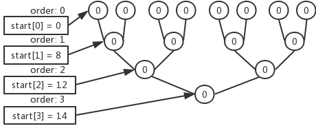
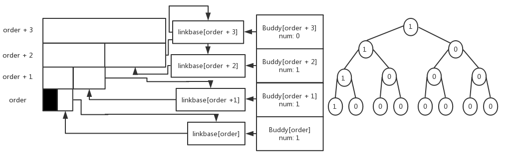

# <center>Buddy System</center>

[toc]

## Principle

In a Buddy System, the whole memory is implemented as a big space of size $2^N$, When a request for memory is made, the search for free space recursively divides free space by two until a block that is just big enough to accommodate the request is found. Here is an example of a 64KB free space getting divided in the search for a 7KB block:


In the example, the leftmost 8KB is allocated and returned to the user, while the rest blocks of 8KB, 16KB, 32KB will be well-maintained to serve following query. The example above also shows,  while eliminating the possibility of external fragmentation in a simple but wonderful way, this scheme can suffer from internal fragmentation.

I have to add that all the pictures except the one above are made by myself.

## Implementation

### Data Structure

In the implementation, we mainly depend on the following data structure:

- The struct **run**, same as what we used in the Lab2. 

- The struct **Buddykmem** to accommodate the vacant blocks of different sizes, in which **free_list** points to the header of the double linked free list and the **num** indicates the number of free blocks in the list. 

- **Linkbase**, the header in the double linked list.

  

- **Order**, the bitmap of the buddy system that indicate whether the corresponding block is vacant, which is helpful in the recursive coalescing and splitting. The size of block vary from $2^0, 2^1, 2^2, ...$ .

- **Start**, to indicate the beginning at every order in a bitmap **order**.

  Below we give an example bitmap of a Buddy System whose max order is 3:

  

- **Base** to indicate the beginning of the Buddy System.

```c
struct run {
	struct run *next;
};
struct Buddykmem {
	struct run *free_list;
	int num;
};
struct run *linkbase[2];
int MAX_ORDER[2];
bool *order[2];
int *start[2];
struct run *base[2];
struct Buddykmem *Buddy[2];
```

Since We first establish a tiny Buddy System in the first 4M memory and then a large one starting at 4M, all the data structures above have two copies.

### Initial

In the boot_alloc_init(), we have to allocate the memory for the data structure we mention above and the pointer **mystart** is an iterator that help us do it . We first calculate the number of vacant pages and then the max order that we can establish for the Buddy System. Then allocate memory for the data structure **order**, **Buddy**, **linkbase**, **start** in turn. We take the order as an example:

```c
order[i] = (bool *)mystart;
memset(order[i], 0, pow_2(level) * 2);
mystart += pow_2(level) * 2;
```

Here **order[i]** is the bitmap of the ith Buddy System, so we first set the beginning of the bitmap using mystart, and then allocate and clear the space of the calculated size and then update the pointer mystart. Linkbase and Buddy can be initialized as follows:

```c
for (int j = 0; j <= level; j++) {
    linkbase[i][j].next = &linkbase[i][j];
    //cprintf("linkbase: %x\n", &linkbase[i][j]);
    Buddy[i][j].free_list = &linkbase[i][j];
}
```

Since the free_list of each order in the Buddy is a double linked list, so we need to initialize it by setting the header's next to point to itself and Buddy's free_list also should point to the corresponding **linkbase**.

```c
base[0] = (struct run *)ROUNDUP(mystart, PGSIZE);
base[1] = (struct run *)P2V(4 * 1024 * 1024);
```

After the procedure above is finished, we set the base, the beginning of the Buddy System. And then Buddyfree_range the memory, which is trivial since we only need to put the whole memory into the free_list of max order. And now, API Buddykalloc() and Buddyfree_range() both involve the order of the blocks we handle with, which we will eliminate in the future.

### Allocate

When invoking kalloc(), we will further invoke the Buddykalloc(0). Buddykalloc(int order) means allocating a block of $2^{order}$ pages. So we need to look up the free_list which accommodates blocks of that size, if hit, then return the corresponding pointer otherwise we may look up the free_list of larger space until the **MAX_ORDER**, if no qualified block is found, then return NULL to indicate the failure. If we find a vacant block of $2^{order + i}$ pages, we need to split it into small ones and return a pointer of a block of $2^{order}$ and insert the rest blocks into the corresponding free_list. When we split the block, we also need to set the corresponding bitmap to indicate that part of the block is occupied. To better illustrate the procedure mentioned above, We take a block of $2^{order + 3}$ pages as an example.



When we find that there is a vacant block of size $2^{order + 3}$, take it out and then split it until we get a block of $2^{order}$, during which we also need to set the corresponding bitmap to 1 and insert the buddy to the free_list.

### Free

```c
if ((void *)v >= (void *)base[1]) {
    idx = (uint32_t)((void *)v - (void *)base[1]) / PGSIZE;
    id = 1;
} else {
    idx = (uint32_t)((void *)v - (void *)base[0]) / PGSIZE;
    id = 0;
}
while (order[id][p] != 1) {
	count++;
	p = start[id][count] + (idx >> count);
}
```

When invoking Buddykfree(char \*v), we first need to determine which Buddy System the block belongs to, and **idx** is the offset of the block from the beginning of the corresponding Buddy System, which helps us to determine the size of the memory we need to free. We iterate in a bottom-up approach to find the first bitmap which is set to 1, the **count** corresponds to the order of the block starting at v. We then reclaim the block of $2^{count}$ pages starting at v, and then set the bitmap to 0. Then we may need to determine if the buddy of this block is vacant, if it is then we need to coalesce them.

```c
int buddy = p ^ 1;
int mark = 1 << (count + 12);
char *buddypos;
while (count < MAX_ORDER[id] && order[id][buddy] == 0) {
    buddypos = (char *)base[id] + ((uint32_t)(v - (char *)base[id]) ^ mark);
    struct run *iter = Buddy[id][count].free_list;
    while (iter->next != (struct run *)buddypos && iter->next != Buddy[id][count].free_list)
        iter = iter->next;
    // buddy is occupied
    if (iter->next != (struct run *)buddypos)
        break;
    struct run *uni = iter->next;
    iter->next = uni->next;
    Buddy[id][count].num--;
    Buddy[id][count].free_list = iter->next;
    v = (v > (char *)uni) ? (char *)uni : v;
    count++;
    mark <<= 1;
    p = start[id][count] + (idx >> count);
    order[id][p] = 0;
    buddy = p ^ 1;
}
```

The pointer of the buddy in the bitmap is easy to get, while the real pointer of the buddy is not trivial, and we need take advantage of the pointer base, the beginning of the Buddy System. Then we need to delete the buddy in the corresponding free list. Since the free list is a double linked list we don't need to consider whether the first block is to be deleted. We just recursively go through the procedure until we find the buddy is occupied or we have reached to the top of the Buddy System.

## Test on sample

In this section, we'll test the correctness of the Buddy System. And to make the life easier, we just do the test in the tiny one before we enter into the vm_init(). We allocate blocks of $2^3, 2^0, 2^8$pages in turn and reclaim them in another sequence and observe the change of the free_list and finally when we reclaim all the blocks we'll only have one vacant block of $2^{9}$pages. And we take allocating and reclaiming the block of $2^3$ as an example.

```c
for (int i = 0; i <= MAX_ORDER[0]; i++)
    cprintf("Buddy: %x\n", Buddy[0][i].free_list->next);

char *p = Buddykalloc(3);
for (int i = 0; i <= MAX_ORDER[0]; i++)
    cprintf("Buddy: %x\n", Buddy[0][i].free_list->next);

kfree(p);
for (int i = 0; i <= MAX_ORDER[0]; i++)
    cprintf("Buddy: %x\n", Buddy[0][i].free_list->next);
```

```
Buddy[0]: f0113dd0
Buddy[1]: f0113dd4
Buddy[2]: f0113dd8
Buddy[3]: f0113ddc
Buddy[4]: f0113de0
Buddy[5]: f0113de4
Buddy[6]: f0113de8
Buddy[7]: f0113dec
Buddy[8]: f0113df0
Buddy[9]: f0124000
After allocate a block of order 3.
Buddy[0]: f0113dd0
Buddy[1]: f0113dd4
Buddy[2]: f0113dd8
Buddy[3]: f012c000
Buddy[4]: f0134000
Buddy[5]: f0144000
Buddy[6]: f0164000
Buddy[7]: f01a4000
Buddy[8]: f0224000
Buddy[9]: f0113df4
After allocate a block of order 0.
Buddy[0]: f012d000
Buddy[1]: f012e000
Buddy[2]: f0130000
Buddy[3]: f0113ddc
Buddy[4]: f0134000
Buddy[5]: f0144000
Buddy[6]: f0164000
Buddy[7]: f01a4000
Buddy[8]: f0224000
Buddy[9]: f0113df4
After allocate a block of order 8.
Buddy[0]: f012d000
Buddy[1]: f012e000
Buddy[2]: f0130000
Buddy[3]: f0113ddc
Buddy[4]: f0134000
Buddy[5]: f0144000
Buddy[6]: f0164000
Buddy[7]: f01a4000
Buddy[8]: f0113df0
Buddy[9]: f0113df4
p: f0124000, q: f012c000, s: f0224000
After reclaiming the block of order 0.
Buddy[0]: f0113dd0
Buddy[1]: f0113dd4
Buddy[2]: f0113dd8
Buddy[3]: f012c000
Buddy[4]: f0134000
Buddy[5]: f0144000
Buddy[6]: f0164000
Buddy[7]: f01a4000
Buddy[8]: f0113df0
Buddy[9]: f0113df4
After reclaiming the block of order 8.
Buddy[0]: f0113dd0
Buddy[1]: f0113dd4
Buddy[2]: f0113dd8
Buddy[3]: f012c000
Buddy[4]: f0134000
Buddy[5]: f0144000
Buddy[6]: f0164000
Buddy[7]: f01a4000
Buddy[8]: f0224000
Buddy[9]: f0113df4
After reclaiming the block of order 3.
Buddy[0]: f0113dd0
Buddy[1]: f0113dd4
Buddy[2]: f0113dd8
Buddy[3]: f0113ddc
Buddy[4]: f0113de0
Buddy[5]: f0113de4
Buddy[6]: f0113de8
Buddy[7]: f0113dec
Buddy[8]: f0113df0
Buddy[9]: f0124000
```

Before allocating, we only have a block of $2^9$ pages, so all the free_lists except the one whose size is $2^9$ pages are vacant, and they only have the header, **linkbase**, of the double linked list. So the first 8 free_list's headers are contiguous and the last one Buddy[9] points to the largest memory's beginning, 0xf0124000. And then after allocating the block of $2^3$ pages, the largest one split into small pieces and we have vacant blocks of size varying from $2^3$ to $2^8$, then when allocating a block of $2^0$, the vacant block of $2^3$ also split as the free_list indicates. Finally, after we reclaiming all the blocks, we'll reach to the largest block again.

## References

During my implementation, I've mainly referred to two Blogs which help me in the following ways.

- to understand <a
  style="text-decoration:none;" href="https://blog.csdn.net/hsly_support/article/details/7483113">the framework of the codes and the main data structure. </a>
- to understand <a
  style="text-decoration:none;" href="https://ilinuxkernel.com/?p=1029">the features and principle of the bitmap in the buddy system. </a>

Also I highly appreciate the inspiring discussion with Hongqin Li who help me fully understand the truth of the bitmap and implement a decoupling initialization of the Buddy System.

And many thanks to **Operating Systems: Three easy pieces**'s example picture to help illustrate the way Buddy System works.

