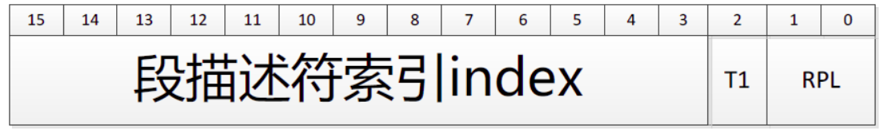

# 
Lab3 Interrupts and Exceptions

[toc]

## Exercise 1

In this section we need to initialize a new segment descriptor **gdt**(Global descriptor table) using the given function *SEG()*. SEG() needs 4 arguments: *type*, *base*, *lim*, *dpl*. Type is assigned to gdt's type bits which accommodate STA_X, STA_W, STA_R. Base refers to the beginning of the segment and lim indicates the scale of this segment. How the limit is stored is determined by gdt's granularity bit. When the bit is set to 0 meaning the granularity is byte and the limit has only 20 bits thus offering 1M space per segment while being set to 1 means the granularity is 4KB bytes and the limit can just store the high 20 bits and offer 4GB space per segment. As what we do in the booting, we just set all the segments' beginning to 0 and limit to 0xffffffff to disable the segment mechanism. As for the dpl, descriptor privilege level, we assign 0 to the kernel state and 3 to the user state, and skip 1 and 2.

## Exercise 2

In this section we need to initialize the interrupt descriptor table which includes 256 entries using the given function *SETGATE()*. SETGATE() needs 5 arguments: gate, istrap, sel, off, d. A gate refers to a interrupt descriptor and istrap is used to distinguish system call from other interrupts. As to the segment selector, the first 2 bits RPL, requested privilege level, reserves the current privilege level and TI,  table indicator, indicates to look up the descriptor in the GDT or LDT(Local descriptor table). And the rest 13 bits can distinguish the descriptors in the GDT. So the GDT have 8192 entries at most.

Alltraps will be called by the interrupt vector. The alltraps will invoke function trap and pass an argument %esp which points to a trap frame in the stack that will offer necessary information to restore the context after the trap function finishes. So before invoking the trap function, we need to push all the registers into the stack except %ss and %esp which will be handled by the processor when mode switch($3 \rightarrow 0$) occurs. After returning from the trap function, we advance the code "addl \$4, %esp" or "popl %esp" interchangeably. And then enter the trapret section where we just pop out the register in the reverse direction. The reason why we add the code "addl \$0x8, %esp" is to skip the trapno and error code in the stack. Finally return to the original task.

## Exercise 3

When a program invokes the *int n* instruction, the instruction will first fetch the n'th descriptor from the IDT, and then check if CPL is less than or equal to DPL which allows the kernel to ban a user program from executing some int instructions.

Then check if CPL is greater than DPL, if it is(from user to kernel) then save %esp and %ss in a CPU-internal registers and then load %ss and %esp from a task segment descriptor, push %ss, %esp(original values stored in the CPU-internal registers), %eflags, %cs, %eip respectively, set %cs and %eip to the values in the descriptor; if not then just begin with pushing %eflags without considering about %ss and %esp. Pushing %ss and %esp only happens when privilege change occurs to establish a new stack for kernel mode since user program may be malicious and break down kernel if kernel shares stack with user.

After the int instruction completes then %eip is pointing to the address specified in the descriptor that is the first instruction of the handler for int n and also the next instruction to execute. And this instruction resides in the vectors.S. The processor then will push the error code and trapno except for some interrupts which will skip pushing the error code since it has been done by the processor and then jmp alltraps. 

The alltraps in the trapasm.S will push the rest segment registers and other general-purpose registers as well as %esp. The %esp points to the trap frame in the stack which will serve as an argument, trapframe \*tf,  for the trap function. Returning from the trap function, we can just popl or addl to skip the %esp and then enter into the trapret section pop the registers including general-purpose and segment registers in the reverse direction and then *addl \$0x8, %esp* to skip the trapno and error code and then iret in which the processor will pop out registers %eip, %cs, %eflags as well as %esp, %ss, if there are, to restore the context before the interrupt. The %cs in stack can help to determine whether a privilege level change occurs and if we should pop %ss and %esp.

## References

During my implementation, I've referred many blogs and the source code of xv6 which help in the following ways:

- To understand <a style="text-decoration:none;" href="https://blog.csdn.net/bfboys/article/details/52431345">How the segment selector works and iteract with Global descriptor table</a>

Also *Intel 64 and IA-32 Architectures-Software Developer’s Manual* helps me recall how the **push** instruction works.

