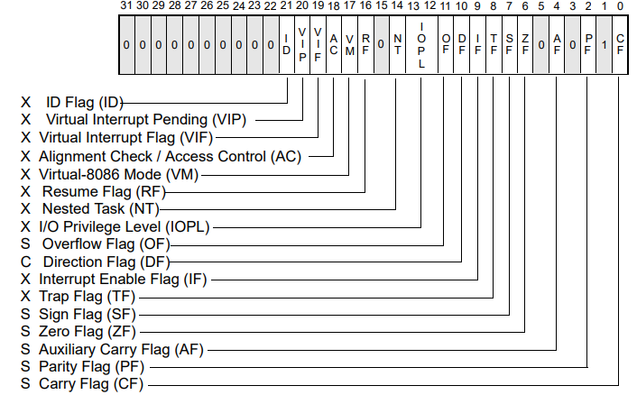

# 
Lab5 Process

[toc]

In this lab, we need to run a *hello, world* binary image in a user-process. 

## Exercise 1

The discussion below will be expanded in the way that the control goes. When the BSP has established virtual memory(page directory table), segment descriptor and interrupt descriptor etc., it then should set up the environment for the user process by invoking **user_init()**. 

In user_init(), we should first call **proc_alloc()** to allocate a new process, then **kvm_init()** to establish a page directory table for the user process(we will additionally map user's running environment to the table before running the code), and then **ucode_load()** to load the binary image to the address specified by the embedded ELF and set the trapframe in the kernel stack. The %eip in trapframe should points to the beginning of the code of the *hello, world* which equals to the e_entry in the ELF header, in this way we can begin running the code after returning from the **trapret()**. Finally set the process's state to *RUNNABLE*, which should be an atomic operation. After all the preparations above have been finished, the kernel stack should look like as follows, with context's %eip pointing to the beginning of **forkret()** and the address of **trapret()** just above %eip, to ensure that kernel process will execute in forkret() and then in trapret() **after context switch code**.

In proc_alloc(), we need to set up a user process. We have to mention that all the operations which make changes to the *process table* should be atomic, also need here, thus acquiring the corresponding lock. Then iterate the table to find an idle process, if found, set its state and pid and release the lock and then allocate space for its kernel stack. And in the stack we should reserve space for the *trapframe* and *context*; if no idle process is available, just release the lock and return *NULL* to indicate failure. If we find an unused process but don't have enough space to allocate for the kernel stack then we also need to set the process's state to *UNUSED* and then return *NULL*. In this function, we need to set context's %eip to point to the address of forkret and leave an entry above the %eip pointing to trapret.

For the establishment of the page directory table of the user process, we first need invoke kvm_init() for the process's *pgdir* to ensures changing page tables in **uvm_switch()** while still executing in the kernel works because the process's page tables have identical mapping for kernel code and data(Address above *KERNBASE*). 

Then in ucode_load(), we need to load all loadable segments from the ELF binary image into the user's address space. There are many ways to reach this goal and we just choose to maintain in the kernel instead of switching into the user's address space. For every segment, we first call **region_alloc()** to allocate space for it and map allocated pages into the process's address space, and then just load the ELF segments as what we do in bootmain.c with only one difference that here we just copy segments from one place in memory to another while in bootmain.c we copy segments from disk to memory. Here we've defined a new function **loaduvm()** to handle the loading. And we also need to allocate a page for the process's stack(actually two pages, the kernel cannot dereference the initial %esp register which is set to *USTACKTOP*, otherwise) and then map it into the process's address space.

Since one segment can contain several pages and the given starting address may not be page-aligned, we need carefully deal with the loading. Here **pgdir_walk()** can help us to locate the page where the destination address resides on(physical address, so need to be translated into virtual address). As for the source address, every segment's starting address equals to $\mbox{address of ELF header} + \mbox{segment.offset}$. And be cautious when dealing with the number of bytes we read every turn. We can find in some segment's header, attribute *memsz* is greater than(at least equals to) *filesz*, since a loadable segment may contain a *.bss* section, which contains uninitialized data, and it would be wasteful to store this data on disk, thus it only occupies space once the ELF file is loaded into memory. And since we have set all the bits to 0 when allocating pages and just copy filesz bytes, we've finished the initialization for the $.bss$ section.

After all the preparations above have been finished, then we can begin to run the code in **ucode_run()**, there is a statement *for(; ; )*, since the scheduler should always be ready to find the runnable process and schedule it to run. And first we need to call **sti()** to enable the interrupt, which is disabled in bootasm.S. Also acquire the ptable's lock since we will change the state of the process which is ready to run.

Then in **uvm_switch()**, set up a task state segment(TSS) descriptor in the GDT using **SEG16()**, whose *base* and *limit* help to find TSS, and also set the descriptor's attribute *s* to 1 which indicates it's for application. And also set %ss0 to the kernel data segment selector and %esp0 to the beginning of kernel stack, which will be in use when an interrupt occurs(priority level 3 $\rightarrow$ 0). We then need to set I/O map base beyond the tss segment limit, which points to the beginning of the I/O permission bit map and the end of the interrupt redirection bit map, to ensure the access to the I/O ports are only determined by the *IOPL* in *eflags*, since according to *Intel 64 and IA-32 Architectures-Software Developer’s Manual*, I/O addresses not spanned by the map are treated as if they had set bits in the map and will results in a general-purpose exception being signaled when a user process want to access.

Back to the setting of *eflags*, we use the macro **FL_IF**, which means setting the IOPL to 0, so only the kernel have access to the I/O and IF to 1 to enable the interrupt. Then **ltr()** load the TSS segment descriptor from GDT to TR register. And we will also load the user page directory table for the user process by calling **lcr3(V2P(p->pgdir))**. And then call **swtch()** to switch to the address space of the user process, and after the user process traps or expires etc, return to the kernel and then call **kvm_switch()** to load the kernel page directory table and repeat this procedure again and again.

## Exercise 2

This section will be expanded in the way that *hello, world* runs. After invoking *swtch()*, we will first enter forkret() to release the lock acquired in the scheduler and then trapret() to set the registers to the context of the user process, and then enter into the environment of the user process and begin to execute the code in libmain.c. First call **umain()** which will call **cprintf()** to print "Hello, world" and then call **exit()** to return to the kernel.

In umain(), when call cprintf(), since we are in the user mode, we need to call system call **sys_cputs()**, which then will generate a system call through the pre-defined function **syscall()** in *lib* using *int 40*. The hardware finds there comes an interrupt and then looks up the interrupt vector, push trap number and optionally error, then jump to **alltraps** to establish a trapframe and then calls **trap()** in trap.c which is responsible to handle all the interrupts and traps. And find that the trapno equals to 0x40, indicating it's a trap and then call another **syscall()** defined in *kern* to handle it. This syscall() has 6 arguments: syscallno, a1~a5, where syscallno specifies which handler to cope with the trap and now it's macro *SYS_cputs*, and we just call **sys_cputs**, passing two arguments a1, pointing to the beginning of the string, and a2, the length of the string. All the handler may have a return value, for example, handler sys_cgetc() will return the character read from the system console. And assign it to tf->eax in trap(), then back to alltraps and finally syscall() in lib and assign the value in %eax register to *ret*, and then return back to sys_cputs() then umain(). After printing the words, we will again call another system call **exit()** whose procedure just goes like cprintf(). When syscall() find the syscallno now equals to *SYS_exit*, it calls **sys_exit()** which then calls **exit()**. 

What we now can do in exit() is setting the user process's state to *ZOMBIE*, and calling **sched()** to return to scheduler. Also since we change the state of process, we need to acquire the lock before the executions above which will be released after returning back to the scheduler. In sched(), we again call swtch() to save current context and switch to the scheduler. And again the scheduler find another runnable process to run.

## Exercise 3

>what dose pushcli() and popcli() do? And why?

**Pushcli()** disables the interrupt through **cli()** and increments the *ncli* while **popcli()** decrements the *ncli* and when its value equals to 0, then enables interrupt through **sti()**. In this case, the popcli() can enable the interrupt only after having called popcli() the same times as pushcli(), just like the push and pop operation.